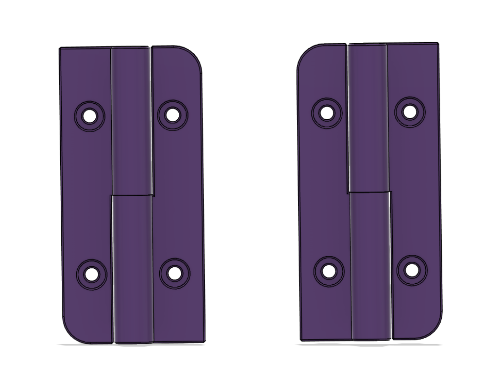

# MoodCube Lift Off Hinges

 Lift off hinges for DoomCube and other 20 base extrusion framed printers.  Each hinge uses two printed halves, and a 5mm pin 60-65mm long.  Seating the pin in the lower half may require help with a hammer.  The top half should slide on and off with little effort.  Both these fits are intentional.  Print upright.  Designed for ABS.
